# 🎭 Mafia Game

A real-time multiplayer implementation of the classic social deduction game Mafia, built with React and PeerJS. Play with friends either offline (pass-the-phone) or online (multiplayer) with no backend server required!

## 🎮 Game Modes

### Offline Mode

Single-device gameplay where players pass the phone to see their roles and make actions.

### Online Mode

Real-time multiplayer where each player uses their own device. No authentication or setup required!

## 📋 Game Rules

### Objective

**Villagers (including Doctor):** Identify and eliminate the Mafia  
**Mafia:** Eliminate villagers without being discovered

### Roles

#### 🔪 Mafia (1 player)

- **Night Action:** Choose one player to eliminate
- **Goal:** Reduce villagers to equal or fewer than Mafia members
- **Strategy:** Blend in during the day, strike at night

#### 💉 Doctor (1 player)

- **Night Action:** Choose one player to save (can save themselves)
- **Goal:** Help villagers identify and eliminate the Mafia
- **Strategy:** Save players you suspect the Mafia will target

#### 👤 Villagers (remaining players)

- **Night Action:** None (in online mode, selections are ignored)
- **Goal:** Vote out the Mafia during the day
- **Strategy:** Discuss and deduce who the Mafia might be

### Game Flow

```mermaid
graph TD
    A[Game Start] --> B[Role Assignment]
    B --> C[🌙 Night Phase]
    C --> D[Mafia Selects Target]
    C --> E[Doctor Selects Save]
    D --> F[Night Resolution]
    E --> F
    F --> G{Someone Eliminated?}
    G -->|Yes| H[Reveal Elimination]
    G -->|No| I[Doctor Saved Target]
    H --> J[☀️ Day Phase - Voting]
    I --> J
    J --> K[Players Vote]
    K --> L[Voting Results]
    L --> M{Win Condition?}
    M -->|Mafia Eliminated| N[🎉 Villagers Win]
    M -->|Mafia ≥ Villagers| O[🔪 Mafia Wins]
    M -->|Game Continues| C
```



### Phase Breakdown

#### 1️⃣ Role Assignment

- Roles are randomly assigned to all players
- Each player privately views their role
- 1 Mafia, 1 Doctor, rest are Villagers

#### 2️⃣ Night Phase

- **All players** select a target simultaneously
- **Mafia's selection:** Player to eliminate
- **Doctor's selection:** Player to save
- **Villagers' selections:** Ignored (in online mode)
- If Doctor saves Mafia's target → No one dies

#### 3️⃣ Night Results

- Reveal if someone was eliminated or saved
- If eliminated, their role is NOT revealed yet

#### 4️⃣ Day Phase - Voting

- All alive players vote simultaneously
- Can vote for any player or choose to skip
- Player with most votes is eliminated
- Ties result in no elimination

#### 5️⃣ Voting Results

- Reveal eliminated player and their role
- Show vote breakdown (if enabled in settings)

#### 6️⃣ Win Conditions

- **Villagers Win:** All Mafia members are eliminated
- **Mafia Wins:** Mafia members ≥ Villager count

## 🚀 Getting Started

### Prerequisites

- Node.js (v14 or higher)
- npm or yarn

### Installation

```bash
# Clone the repository
git clone https://github.com/yourusername/mafia-game.git

# Navigate to project directory
cd Mafia_Game

# Install dependencies
npm install

# Start development server
npm run dev
```

The game will be available at `http://localhost:5173/`

### Building for Production

```bash
npm run build
```

## 🌐 Online Multiplayer Setup

### Creating a Room

1. Select **"Play Online"** from the main menu
2. Click **"Create Room"**
3. Enter your name
4. Share the **6-character room code** with friends

### Joining a Room

1. Select **"Play Online"** from the main menu
2. Click **"Join Room"**
3. Enter your name and the room code
4. Wait in the lobby for the host to start

### Lobby Settings (Host Only)

- **Show Vote Details:** Display who voted for whom after voting
- **Night Phase Timer:** 30-second countdown for night actions
- **Day Discussion Timer:** 60-second countdown for discussion
- **Kick Players:** Remove players from the lobby
- **Number of Mafia:** Currently fixed at 1 (future enhancement)

### Starting the Game

- Minimum **4 players** required
- All players must mark themselves as **Ready**
- Host clicks **"Start Game"**

## 🎯 Gameplay Tips

### For Villagers

- Pay attention to voting patterns
- Discuss suspicions during the day phase
- Work together to identify the Mafia
- The Doctor should try to stay hidden

### For the Doctor

- Don't reveal your role too early
- Save players who seem likely targets
- You can save yourself if threatened
- Consider who the Mafia might target

### For the Mafia

- Act like a villager during discussions
- Vary your voting patterns
- Target influential or suspicious players
- Try to eliminate the Doctor early

## 🛠️ Technical Details

### Built With

- **React** - UI framework
- **Vite** - Build tool and dev server
- **PeerJS** - WebRTC peer-to-peer connections
- **short-unique-id** - Room code generation

### Architecture

#### Offline Mode

- Single GameContext managing all state
- Sequential phase transitions
- Pass-the-phone mechanics

#### Online Mode

- **Host-based P2P model**
- Host manages game state as source of truth
- Peers send actions to host
- Host broadcasts updates to all peers
- **No backend server required**

### Key Features

- ✅ Real-time synchronization
- ✅ Responsive design (mobile-friendly)
- ✅ No authentication required
- ✅ Free to use (PeerJS cloud server)
- ✅ Return to lobby after game for rematches

## 📁 Project Structure

```
Mafia_Game/
├── src/
│   ├── components/
│   │   ├── online/              # Online multiplayer components
│   │   │   ├── CreateRoom.jsx
│   │   │   ├── JoinRoom.jsx
│   │   │   ├── Lobby.jsx
│   │   │   ├── OnlineGame.jsx
│   │   │   ├── OnlineRoleReveal.jsx
│   │   │   ├── OnlineNightPhase.jsx
│   │   │   ├── OnlineNightResult.jsx
│   │   │   ├── OnlineVotingPhase.jsx
│   │   │   ├── OnlineVotingResult.jsx
│   │   │   └── OnlineGameEnd.jsx
│   │   ├── GameSetup.jsx        # Offline mode setup
│   │   ├── RoleReveal.jsx       # Offline role reveal
│   │   ├── NightPhase.jsx       # Offline night phase
│   │   ├── VotingPhase.jsx      # Offline voting
│   │   └── ModeSelection.jsx    # Mode selection screen
│   ├── context/
│   │   ├── GameContext.jsx      # Offline game state
│   │   └── MultiplayerContext.jsx # Online P2P state
│   ├── utils/
│   │   └── gameLogic.js         # Game mechanics
│   ├── App.jsx                  # Main app with routing
│   └── index.css                # Styles
├── package.json
└── README.md
```

## ⚠️ Known Limitations

### Host Dependency

- If the host disconnects, the game will end
- This is a limitation of the serverless P2P architecture
- Future enhancement: Host migration

### PeerJS Cloud Server

- Uses free public PeerJS cloud server
- May have latency depending on server load
- No setup or authentication required

## 🔮 Future Enhancements

- [ ] Full peer-to-peer synchronization (currently simplified)
- [ ] Reconnection handling for disconnected players
- [ ] Timer functionality for night/day phases
- [ ] Chat functionality in lobby
- [ ] Support for multiple Mafia members
- [ ] Additional roles (Detective, Vigilante, etc.)
- [ ] Spectator mode for eliminated players
- [ ] Host migration if host disconnects
- [ ] Game history and statistics
- [ ] Custom game settings (role distribution)

## 🤝 Contributing

Contributions are welcome! Please feel free to submit a Pull Request.

1. Fork the project
2. Create your feature branch (`git checkout -b feature/AmazingFeature`)
3. Commit your changes (`git commit -m 'Add some AmazingFeature'`)
4. Push to the branch (`git push origin feature/AmazingFeature`)
5. Open a Pull Request

## 📝 License

This project is open source and available under the [MIT License](LICENSE).

## 🙏 Acknowledgments

- Classic Mafia party game
- PeerJS for making P2P connections simple
- React community for excellent tools and libraries

## 📞 Support

If you encounter any issues or have questions:

- Open an issue on GitHub
- Check existing issues for solutions

---

**Enjoy the game! May the best team win! 🎭**
